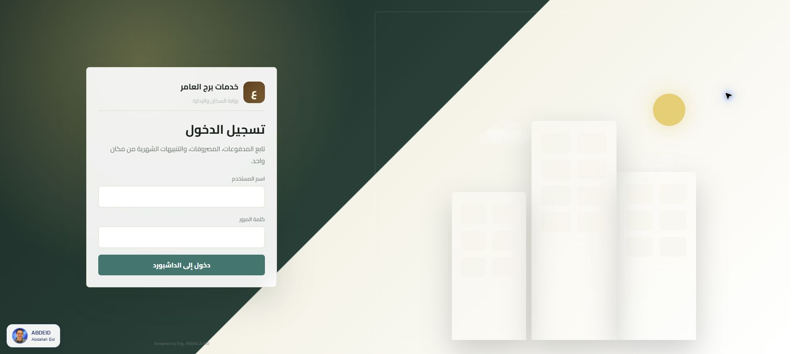
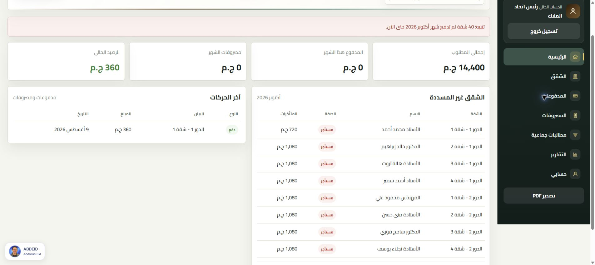

  

<h1 align="center">AMER — Building Management</h1>

نظام خدمات برج العامر · إدارة الشقق وخدمات المبنى والتحصيل المالي

<a href="https://amer.abdeid.com/">الديمو</a> · <a href="https://github.com/ABDEID-dev">Abdallah Eid</a> · <a href="LICENSE">الترخيص</a>

واجهة عربية لإدارة خدمات المباني السكنية، تجمع بيانات الشقق والسكان، الاشتراكات الشهرية، المتأخرات، المصروفات والمطالبات المشتركة في مكان واحد. تمنح الإدارة رؤية واضحة للتحصيل والرصيد، وتتيح للسكان متابعة بيانات حساباتهم ومصروفات المبنى.

مناسب لمتابعة خدمات مبنى يضم ملاكًا ومستأجرين. النسخة الحالية تدير الخدمات والتحصيل؛ لا تتضمن إبرام عقود بيع أو إيجار أو تحصيل الإيجار العقاري.

## الديمو

[فتح الديمو — amer.abdeid.com](https://amer.abdeid.com/)

| بيانات الدخول | القيمة |
| --- | --- |
| اسم المستخدم | `admin` |
| كلمة المرور | `123456789` |

هذه بيانات حساب الديمو التي قدمها صاحب المشروع، وقد تختلف عن بيانات التثبيت المحلي. تعذر التحقق من النطاق وقت إعداد التوثيق؛ التقطت الصور من النسخة المحلية عبر XAMPP.

## المميزات

- **إدارة الشقق:** تنظيم الأدوار والوحدات وبيانات السكان وصفة الإشغال وحالة التشطيب والمتأخرات السابقة.
- **التحصيل الشهري:** تسجيل المدفوعات ومراجعة سجل التحصيل حسب الشهر.
- **المصروفات:** تسجيل بنود الصرف والمبالغ والتواريخ مع إرفاق صور أو ملفات PDF للفواتير.
- **المطالبات الجماعية:** توزيع المصروفات المشتركة بالتساوي على الشقق المشطبة.
- **التقارير:** عرض إجمالي التحصيل والمصروفات والرصيد وحالة سداد كل شقة.
- **حسابات الإدارة والسكان:** واجهات وصلاحيات تناسب كل نوع حساب.
- **التنبيهات:** متابعة الشقق غير المسددة والمستحقات الشهرية.
- **واجهة عربية:** تصميم يدعم اتجاه الكتابة من اليمين إلى اليسار والشاشات المختلفة، مع تصدير PDF.

## لقطات الشاشة

التقطت من النسخة المحلية بتاريخ 7 أكتوبر 2026، مع بصمة ABDEID في زاوية الواجهة.

### تسجيل الدخول

بوابة موحدة للإدارة والسكان، تتيح الوصول إلى الحساب باستخدام اسم المستخدم وكلمة المرور ضمن واجهة عربية واضحة.

### لوحة القيادة

ملخص مالي يعرض المطلوب والمدفوع والمصروفات والرصيد، مع تنبيه بالشقق غير المسددة وقائمة المتأخرات وآخر الحركات.

### الشقق والحسابات

مساحة لإدارة بيانات الشقق والأدوار والسكان وصفة الإشغال والتشطيب، ومراجعة الحسابات المرتبطة بالوحدات والمتأخرات السابقة.

### المدفوعات الشهرية

واجهة لتوثيق مبالغ التحصيل وربطها بالشقة والشهر، مع سجل يساعد الإدارة على مراجعة المدفوعات وتواريخها.

### المصروفات والفواتير

توثيق أوجه الصرف ومبالغها وتواريخها وإرفاق الفواتير، مع عرض مصروفات المبنى للسكان لتعزيز وضوح الحسابات.

### المطالبات الجماعية

تنظيم المطالبات المشتركة وتوزيع إجمالي المبلغ بالتساوي على الشقق المشطبة، مع سجل للمطالبات وتفاصيلها.

### التقارير المالية

متابعة إجمالي التحصيل والمصروفات والرصيد والمتأخرات، ومقارنة حالة السداد والتشطيب والإشغال لكل شقة في الشهر المحدد.

### الحساب الشخصي

عرض نوع الحساب ومؤشراته المالية، وتوفير واجهة لتحديث بياناته من داخل النظام.

## التقنيات

PHP · MySQL · JavaScript · HTML · CSS · Apache

## التشغيل المحلي باستخدام XAMPP

1. ضع المشروع في `C:\xampp\htdocs\amer`، ثم شغّل Apache وMySQL.
2. أنشئ قاعدة بيانات باسم `amer` في phpMyAdmin واستورد `database.sql` في قاعدة جديدة.
3. انسخ `config.example.php` إلى `config.php`، ثم أدخل بيانات اتصال القاعدة المحلية. في تثبيت XAMPP الافتراضي يكون المستخدم عادةً `root` وكلمة المرور فارغة.
4. تأكد من أن PHP يستطيع الكتابة في مجلد `uploads`.
5. افتح `http://localhost/amer/`.

بيانات قاعدة التثبيت المرفقة: الإدارة `admin / admin123`، وحسابات السكان `apt1` إلى `apt48` بكلمة مرور `123456`. هذه حسابات تجريبية للتثبيت؛ غيّرها قبل استخدام النظام ببيانات حقيقية.

لترقية قاعدة قديمة، راجع ملفات `migrations_*.sql` وطبّق ما يلزم للإصدار المستخدم بعد أخذ نسخة احتياطية. ملف تهيئة الأدوار والشقق يحتوي بيانات ابتدائية، فلا تطبقه عشوائيًا على قاعدة تشغيل فعلية.

## النشر على cPanel

أنشئ قاعدة MySQL ومستخدمًا لها، واستورد مخطط قاعدة البيانات. ارفع ملفات التطبيق و`assets` و`uploads` و`.htaccess`، وأنشئ `config.php` على الخادم ببيانات الاستضافة. يحتاج Apache إلى دعم قواعد إعادة كتابة الروابط الموجودة في `.htaccess`.

## الترخيص والملكية

Copyright © 2026 **Abdallah Eid / ABDEID**. المشروع متاح لعرض الكود بموجب [ترخيص ABDEID الخاص](LICENSE)، وليس ترخيصًا مفتوح المصدر. الاستخدام أو التعديل أو إعادة التوزيع أو الاستضافة التجارية يتطلب إذنًا كتابيًا من صاحب الحقوق. تبقى حقوق مكونات الطرف الثالث وتراخيصها محفوظة.

## التواصل

- **المطور:** Abdallah Eid — ABDEID
- **GitHub:** [ABDEID-dev](https://github.com/ABDEID-dev)
- **التواصل والترخيص:** [WhatsApp](https://wa.me/971551806906)
